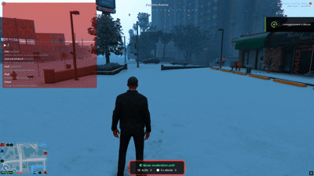

# ❄️ OldSnowBall – Snowball Pickup Script




---

## ❄️ Overview

**OldSnowBall** is a lightweight and immersive FiveM script that allows players to **pick up snowballs from the ground** using a realistic animation and a clean progress circle powered by **ox_lib**.
It also integrates seamlessly with **ox_inventory** to add snowballs directly into the player’s inventory.

---

## 🎮 Features

* ❄️ **/snowball** command to pick up a snowball
* 🎞️ Smooth pickup animation
* 🔄 Progress circle using **ox_lib**
* 🏠 Interior detection (cannot pick up snowballs indoors)
* 🎁 Gives snowballs to the player via **ox_inventory**

---

## 📦 Dependencies

This script requires:

* **ox_lib**
* **ox_inventory**

Make sure both resources are installed and started before this script.

---

## ⚙️ How It Works

1. The player uses the **/snowball** command.
2. A pickup animation plays along with a progress circle.
3. Once completed, the player receives a snowball in their inventory.
4. If the player is indoors, the script prevents the action and displays an error notification.

---

## 📁 Installation

1. Download the resource
2. Place it in your FiveM `resources` folder
3. Add the following to your `server.cfg`:

```cfg
ensure ox_lib
ensure ox_inventory
ensure old_snowball
```
